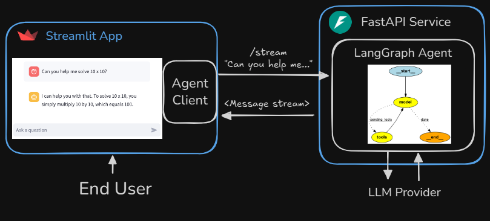
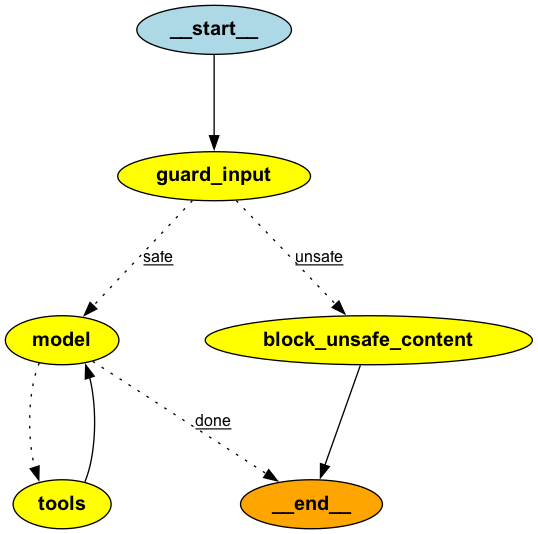

# AgentHub


## Overview

**AgentHub** is a full-stack, multi-agent AI assistant system designed for advanced, configurable conversational and data-driven applications. Built with Python, LangChain, LangGraph, FastAPI, and Streamlit, it supports a wide range of use cases—from simple chat and PDF Q&A, to SQL data querying, live Web Search, Wikipedia lookups, and scientific paper research via ArXiv.

---

### Live Demo

- **AWS EC2:** http://3.88.134.213:8501
- **Render:** https://agenthub-yashchinchole.onrender.com


---

## Features

- **Multi-Agent Architecture:**  
  Choose from 6 specialized agents, each tailored for specific tasks:

  - **1. Chatbot**  
    A versatile, general-purpose conversational AI for everyday question answering and assistance.
  - **2. RAG Agent (PDF/Docs Q&A)**  
    Retrieval-Augmented Generation using document databases like ChromaDB for querying unstructured document data.
  - **3. SQL Agent**  
    Conversational SQL querying over the Chinook database. Generate, execute, and explain SQL queries seamlessly.
  - **4. Research Assistant**  
    Up-to-date web search integration via DuckDuckGo to fetch and cite live facts, and a calculator for instant math and conversions.
  - **5. Wikipedia Search Agent**  
    Quick lookup and summarization of Wikipedia entries for factual queries.
  - **6. Scientific Paper Search (ArXiv)**  
    Search and summarize scientific papers from ArXiv, aiding research in various domains.

- **Langsmith Tracing Integration:**  
  Collects detailed data on prompts, responses, and feedback for evaluation and improvement.
- **Docker Support:**  
  Pre-built Docker images and Docker Compose config simplify development, testing, and deployment.
- **UV Package Manager Integration:**  
  Robust environment and dependency management with `uv`, ensuring reproducible setups.
- **Advanced Streaming Support:**  
  Supports both token-level and message-level streaming for optimal user experience.
- **Dynamic and Extensible Architecture:**  
  Modular agent design enabling easy addition of new agents or capabilities with minimal effort.
- **FastAPI Backend Service:**  
  Highly performant async backend exposing streaming and non-streaming endpoints.
- **Asynchronous Design:**  
  Efficient async/await concurrency to handle multiple simultaneous users and agents.
- **Content Moderation & Safety:**  
  Integrated LlamaGuard content moderation to ensure safe interactions.
- **RAG Assistant Implementation:**  
  Includes a basic but powerful RAG agent powered by ChromaDB.
- **Feedback Collection:**  
  User star-based feedback mechanism fully integrated with LangSmith telemetry.

---

## Architecture



_Orchestrates user interactions through Streamlit and FastAPI into LangGraph, where multiple agents collaboratively invoke tools, manage state, leverage the LLM provider, and stream structured results back to the user interface._

---

## Agent Diagram



---

## Tech Stack

- **Python:** General purpose backend and data processing
- **LangChain:** LLM and tool integration framework
- **LangGraph:** Agent orchestration, state management, and graph workflow composition
- **FastAPI:** Asynchronous backend web service with REST and streaming endpoints
- **Streamlit:** Frontend UI for chat and agent control
- **ChromaDB:** Vector database for document retrieval (RAG assisted)
- **SQL (SQLite):** Chinook sample database for SQL agent queries
- **OpenAI, Groq:** Supported LLM providers via unified interface
- **LlamaGuard:** AI-based content moderation for user and AI messages (via Groq)
- **DuckDuckGo Search (ddgs):** Free web search integration without API keys
- **UV:** Python environment and dependency manager for consistent builds
- **Docker & Docker Compose:** Containerization and deployment configurations
- **LangSmith:** Observability and feedback platform integration

---

## Project Structure

```
└── AgentHub/
    ├── README.md
    ├── docker-compose.prod.yml
    ├── langgraph.json
    ├── pyproject.toml
    ├── requirements.txt
    ├── uv.lock
    ├── .dockerignore
    ├── .env.example
    ├── docker/
    │   ├── Dockerfile.app
    │   └── Dockerfile.service
    ├── scripts/
    │   └── create_chroma_db.py
    └── src/
        ├── run_agent.py
        ├── run_client.py
        ├── run_service.py
        ├── streamlit_app.py
        ├── agents/
        │   ├── __init__.py
        │   ├── agents.py
        │   ├── arxiv_agent.py
        │   ├── chatbot.py
        │   ├── llama_guard.py
        │   ├── rag_assistant.py
        │   ├── research_assistant.py
        │   ├── sql_agent.py
        │   ├── tools.py
        │   └── wikipedia_agent.py
        ├── client/
        │   ├── __init__.py
        │   └── client.py
        ├── core/
        │   ├── __init__.py
        │   ├── llm.py
        │   └── settings.py
        ├── memory/
        │   ├── __init__.py
        │   └── sqlite.py
        ├── schema/
        │   ├── __init__.py
        │   ├── models.py
        │   ├── schema.py
        │   └── task_data.py
        └── service/
            ├── __init__.py
            ├── service.py
            └── utils.py
```

The project follows a modular architecture with clear separation of concerns:

- **`agents/`**: Contains all specialized AI agents and their implementations
- **`core/`**: Core LLM integration and configuration settings
- **`service/`**: FastAPI backend service and utilities
- **`client/`**: Client-side communication layer
- **`schema/`**: Data models and task definitions
- **`memory/`**: Persistent storage and memory management
- **`docker/`**: Containerization configurations
- **`scripts/`**: Utility scripts for setup and maintenance
